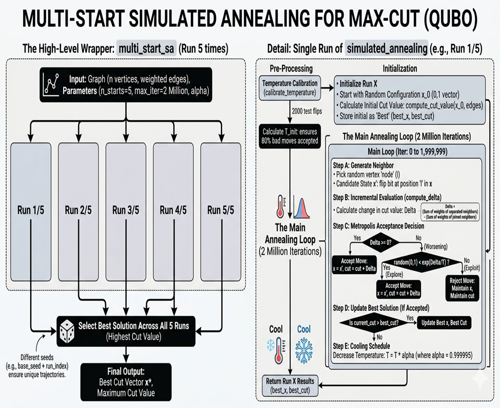
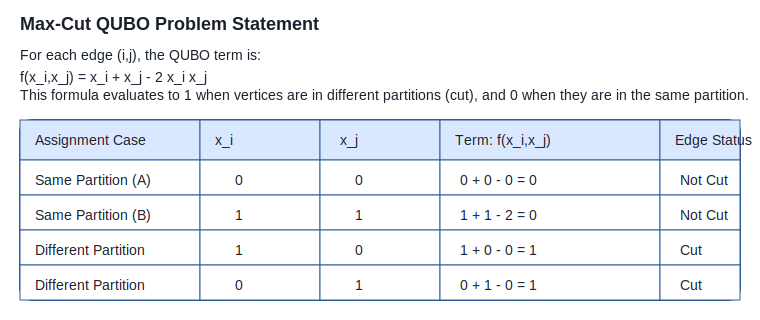

# Max-Cut Optimisation

This project implements a Simulated Annealing solver for the Max-Cut problem and benchmarks it against Toshiba SBM results.



## Problem Statement

The Max-Cut problem is formulated as a QUBO (Quadratic Unconstrained Binary Optimization) problem. Each decision variable `x_i ∈ {0,1}` indicates the partition of node `i`, and an edge `(i,j)` contributes:

```
term = x_i + x_j - 2 x_i x_j
```

This term evaluates to `1` when the edge is cut (endpoints in different partitions) and `0` when the edge is not cut (endpoints in the same partition).



## Project Plan

The solver uses a multi-start Simulated Annealing strategy:

- Initialize multiple random solutions with different seeds
- Run each SA trajectory for a fixed number of iterations
- Use incremental delta evaluation for edge flips
- Apply Metropolis acceptance to escape local optima
- Track the best cut value per run
- Select the best solution across all runs

This structure makes the approach robust to local optima and produces consistent performance on GSET benchmark graphs.

## Structure

- `parser.py`: Functions to parse GSET graph files.
- `sa_classes.py`: Classes for SA parameters and results.
- `sa_core.py`: Core SA algorithm and evaluation functions.
- `benchmark.py`: Benchmarking functions and Toshiba SBM values.
- `main.py`: Main entry point to run the benchmark.

## Setup

1. Create a `Graph_Data` folder and place GSET .txt files there.
2. Adjust `BASE_DIR` in `main.py` to point to the correct directory.
3. Run `python main.py`

## Benchmark Results

Benchmark results were collected from the `Max_Cut_Benchmark` sheet in the shared Google Spreadsheet.

- Total instances: **40**
- Average gap vs Toshiba SBM: **0.70%**
- Average runtime: **23.32 seconds**
- Exact match to Toshiba SBM on **4 / 40** graphs

### Sample Results

| Graph | n | Edges | Our Cut | Toshiba SBM | Gap % | Time (s) |
|------:|--:|------:|--------:|-------------:|------:|---------:|
| G1 | 800 | 19176 | 11624 | 11624 | 0.00 | 47.03 |
| G2 | 800 | 19176 | 11595 | 11620 | 0.22 | 44.99 |
| G3 | 800 | 19176 | 11615 | 11622 | 0.06 | 46.83 |
| G4 | 800 | 19176 | 11638 | 11646 | 0.07 | 46.46 |
| G5 | 800 | 19176 | 11625 | 11631 | 0.05 | 46.52 |

Detailed benchmark data is available in the Google Sheet: [Max_Cut_Benchmark](https://docs.google.com/spreadsheets/d/1Vwo1Fi4oYVJ0CTg8YfIhmtVyDnBkhli5c1R0brgjio0/edit?gid=2085508115#gid=2085508115).

## Documentation

This README now includes the problem formulation, algorithm plan, and benchmark summary needed for project documentation and resume references.
