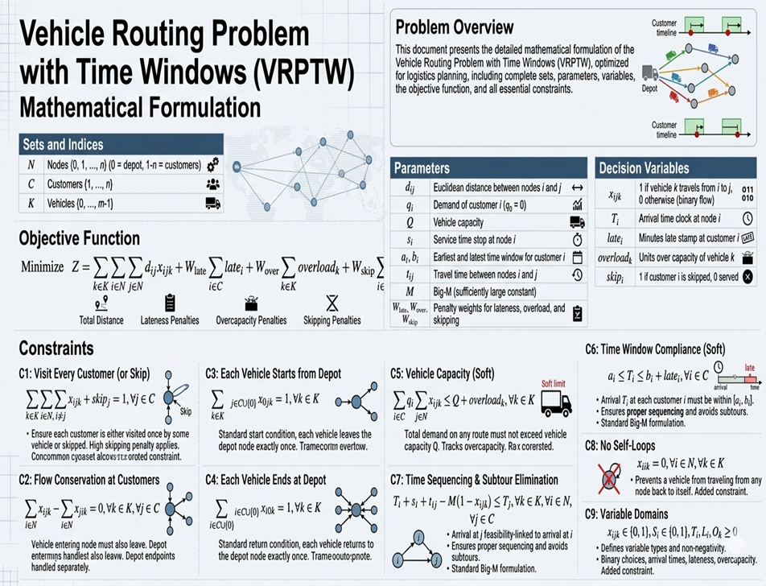
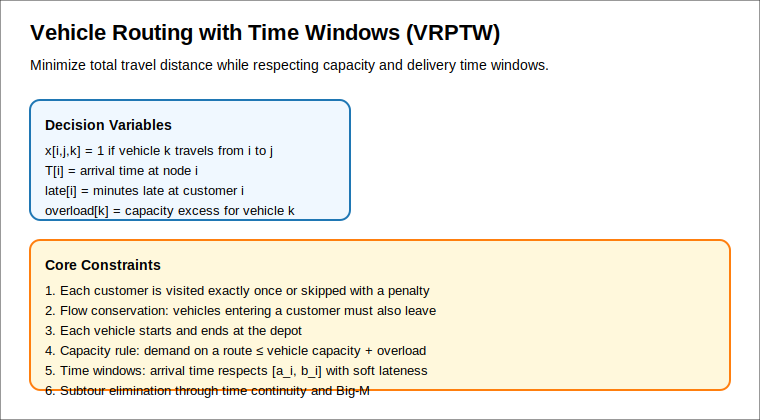

# Vehicle Routing with Time Windows (VRPTW) Solver

This project implements a Vehicle Routing Problem with Time Windows (VRPTW) model for the QPIAI assignment. It generates synthetic customer data, formulates the problem as a MILP, solves it with an open-source solver, and provides route output.





## Problem Statement

A logistics company must deliver goods from a single depot to multiple customers. Each customer has:

- A delivery time window
- A demand
- A required service time

Each vehicle has a capacity constraint. The objective is to minimize total travel distance while satisfying all constraints.

## Dataset Requirements

The project generates synthetic datasets with the following fields:

- Customer ID
- Coordinates (x, y)
- Demand (units)
- Time Window Start
- Time Window End
- Service Time
- Vehicle Capacity
- Depot Coordinates

## Solution Approach

The solver uses an open-source MILP formulation.

### Model Components

- Decision variables:
  - `x[i,j,k]` = 1 if vehicle `k` travels from node `i` to node `j`
  - `T[i]` = arrival time at node `i`
  - `late[i]` = lateness at customer `i`
  - `overload[k]` = capacity excess for vehicle `k`
  - `skip[i]` = 1 if customer `i` is skipped

- Objective:
  - Minimize total distance plus penalty terms for late arrivals, overloads, and skipped customers.

- Constraints:
  - Each customer is visited exactly once or skipped.
  - Flow conservation at customer nodes.
  - Each vehicle starts and ends at the depot.
  - Vehicle capacity constraints with overload slack.
  - Time window constraints with soft lateness.
  - Time-continuity constraints to enforce route timing.

## Deliverables

1. VRPTW MILP formulation in `project-6/vrptw_solver_qpiai.py`
2. Open-source solver integration using CBC via Pyomo
3. Synthetic dataset generation and solution demonstration
4. Visual representation of the model and route structure

## Usage

### Install Dependencies

```bash
pip install pyomo
sudo apt-get update && sudo apt-get install -y coinor-cbc
```

### Run the Solver

```bash
cd project-6
python3 vrptw_solver_qpiai.py
```

### Expected Output

- Synthetic dataset summary
- Solver status and objective value
- Route summary for each vehicle
- Constraint violation report

## Trade-offs and Interpretation

### Trade-off between distance and time windows

Minimizing travel distance can conflict with tight customer time windows. The model uses soft lateness variables so the solver can trade a small time window violation for a better route when necessary.

### Constraints Modeling

- Vehicle capacity is modeled using a capacity constraint and overload slack to avoid infeasibility.
- Time windows are enforced with arrival time bounds and soft penalties for lateness.

## Solution Methodology

This project uses an exact MILP formulation.

### Exact formulation vs heuristics

- Exact MILP formulations provide optimality guarantees for small to medium instances.
- Heuristics scale better for larger VRPTW instances but may not guarantee optimality.

### Scalability and performance

- The CBC solver is suitable for open-source experimentation.
- For larger problem sizes, performance can degrade due to the combinatorial search tree.
- The dataset generator and model builder are modular and can be extended for larger instances.

## Files

- `vrptw_solver_qpiai.py` — solver implementation and dataset generator
- `vrptw-formulation.svg` — problem formulation illustration
- `README.md` — project documentation
